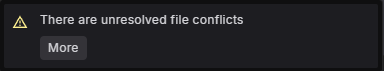
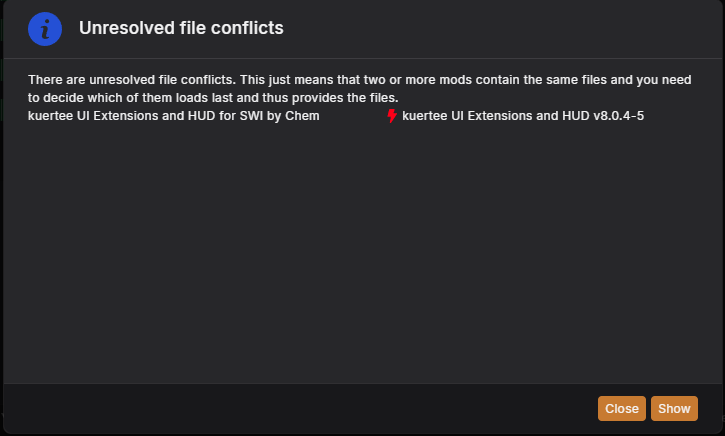
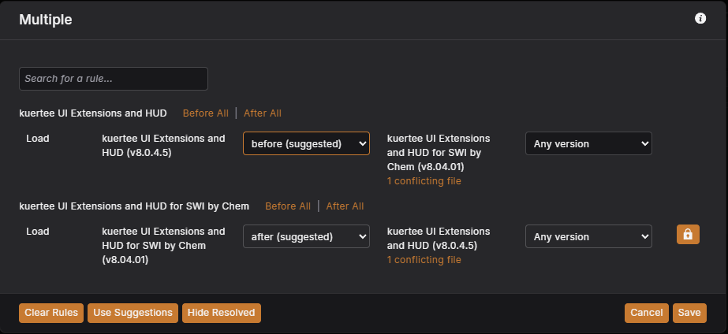
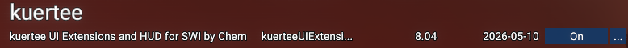

# kuertee UI Extensions and HUD for SWI by Chem

This patch mod makes possible to load the UI Extensions and HUD after Star Wars Interworlds. This will give you possibility to use all latest features of UI Extensions and HUD in comparison with embedded one.

## Features

- Replaces only one content.xml file of UI Extensions and HUD to ensure the loading order.
- Does not change any content of UI Extensions and HUD, so you will get all latest features of it.
- Makes possible to use newest (in comparison with embedded) version of UI Extensions and HUD with Star Wars Interworlds.

## Installation

This mod can be installed in three ways - manual installation, Vortex installation and Collection installation. Please choose the one that suits you best.

First two methods can be done via More details on the mod page on [Nexus Mods](https://www.nexusmods.com/x4foundations/mods/2134).

### Manual Installation

- Install Star Wars Interworlds and kuertee UI Extensions and HUD mods first.
- Download the latest version of the mod from the Nexus Mods page.
- Extract the downloaded archive to extensions folder of your X4 installation directory with overwriting the only one file in it - `content.xml`.

### Vortex Installation

- Install Star Wars Interworlds and kuertee UI Extensions and HUD mods first.
- Download the latest version of the mod from the Nexus Mods page using Vortex.
- You will get a notification about file conflict.
  
- Click on "More" button and you will see something like this:
  
- Click on "Show" button and you have possibility to set a rule for the extensions.
- Please set the rule like this, i.e. make the UI Extensions and HUD for SWI to load always after UI Extensions and HUD mod:
  

### Collection Installation

Collection installation can be done via Collection Page on [Nexus Mods](https://www.nexusmods.com/games/x4foundations/collections/4lmz4).

This collection contains four mods:

- Star Wars Interworlds - latest version of Star Wars Interworlds mod.
- kuertee UI Extensions and HUD - latest version of UI Extensions and HUD mod.
- SirNukes Mod Support APIs - latest version of SirNukes Mod Support APIs mod.
- kuertee UI Extensions and HUD for SWI - this mod.

There is one reason to make this collection - to ensure the loading order of mods. It has include the rule which make the UI Extensions and HUD for SWI to overwrite the original `content.xml` file of UI Extensions and HUD mod. So you will get all latest features of UI Extensions and HUD mod with Star Wars Interworlds mod.

### Verification

After successful installation you should see a next picture in the extensions menu:

## Compatibility

This mod currently oriented on a X4: Foundations version 8.00 with latest hotfixes, as there is a latest version supported by Star Wars Interworlds mod.

## Credits

- **Author**: Chem O`Dun, on [Nexus Mods](https://next.nexusmods.com/profile/ChemODun/mods?gameId=2659) and [Steam Workshop](https://steamcommunity.com/id/chemodun/myworkshopfiles/?appid=392160)
- *"X4: Foundations"* is a trademark of [Egosoft](https://www.egosoft.com).

## Acknowledgements

- [EGOSOFT](https://www.egosoft.com) - for the X series.
- **Star Wars Interworlds Team** - for the Star Wars Interworlds mod.
- [kuertee](https://next.nexusmods.com/profile/kuertee?gameId=2659) - for the `UI Extensions and HUD` that makes this extension possible.
- [SirNukes](https://next.nexusmods.com/profile/sirnukes?gameId=2659) - for the `Mod Support APIs` that power the UI hooks.

## Changelog

### [8.04.01] - 2024-05-29

- Initial public version.